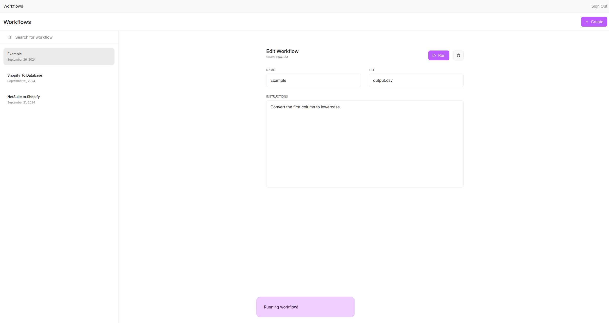

# Workflows

## Description

Frontend and backend for a workflow automation demo I created during my internship at [Sonans AI](https://sonans.ai). Via a frontend user interface,
a user can upload a `csv` spreadsheet and request alterations in pure English (e.g. "Capitalize the first word in column C."). Within the OpenAI sandbox environment, a model constructs and executes a Python script to complete the request. The backend then sends the file back to the user to download. Take a look at the Figma file containing the ER model of the database and the frontend design [here](https://www.figma.com/design/D2a4DHkXG06kxfpSu1Vu5R/Sonans-AI-Workflows?node-id=0-1&t=wu7SUDbEO5dR4hhd-1).

## Key features

- REST api and backend
- Convert `csv` files in pure English
- Create, remove, edit, and fuzzy search for workflows
- Session based user authentication
- Company specific sign in via subdomain

## Built with

- `Python`
- `PostgreSQL`
- `Flask`
- `Celery`
- `React` + `Remix`
