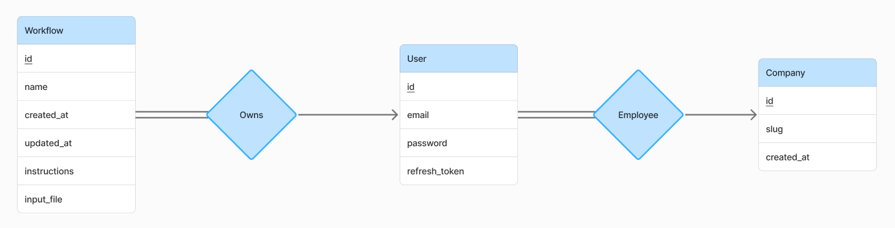

# /api

App backend. Built with `Python`, `Flask`, and `Celery`. Styled with `Black`.

## Requirements

- `Python` (version >3.11).
- `Virtualenv`.
- `Redis`.
- `PostgreSQL`.

## Setup

1. Ensure `Redis` is running.
2. Create a `PostgreSQL` database called `sonans`.
3. Paste and execute `database_dump.sql` in the `sonans` database.
4. Create a virtual environment. Then activate it. Then run `pip install -r requirements.txt`.
5. Follow the instructions in `setup_database.py` to create a frontend login.
6. Copy `.env.template` to `.env`.
7. Setup `.env`:
   - Set `DATABASE_URI` in `.env` to your `PostgreSQL` connection string.
   - Set `OPENAI_API_KEY` in `.env` to your OpenAI API key.
   - Set `ASSISTANT_ID` to your OpenAI assistant ID.

## Development

- Run `celery -A make_celery worker --loglevel=INFO`.
- Run `flask -A app run --debug`.

## ER Model

