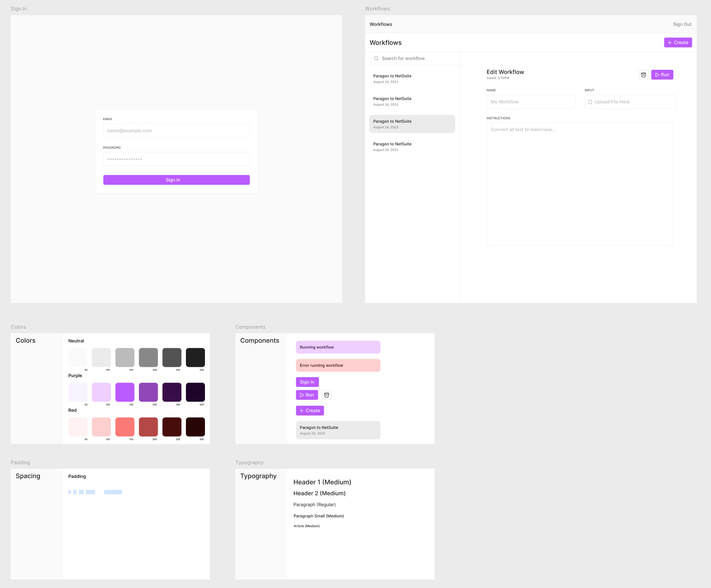

# /frontend

App frontend. Built with `Remix`, `React`, and `SASS`. Styled with `Prettier`.

## Requirements

- `NodeJS`.
- `SASS`.

## Setup

1. Copy `.env.template` to `.env`.
2. Set `API_URL` in `.env` to the Flask API url.
3. Run `npm install`.

## Development

1. Ensure Flask and Celery are running in `/api`.
2. Run `npm run dev`.
3. Run `sass app/styles/globals.scss app/styles/export.css --watch`.

## Deployment

1. Run `npm run build`.
2. Run `npm start`.

## Design

